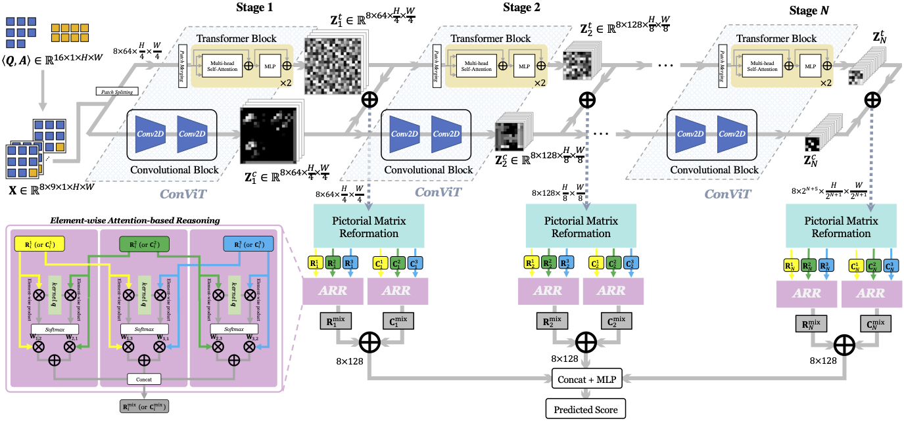

# HCV-ARR
This repo contains code for our AAAI 2023 paper: 

[**Hierarchical ConViT with Attention-based Relational Reasoner for Visual Analogical Reasoning**]()  
[Wentao He](https://wentaoheunnc.github.io/), [Jialu Zhang](https://scholar.google.com/citations?hl=en&user=kec4TpMAAAAJ), [Jianfeng Ren](https://research.nottingham.edu.cn/en/persons/jianfeng-ren), [Ruibin Bai](http://www.cs.nott.ac.uk/~znzbrbb/), [Xudong Jiang](https://personal.ntu.edu.sg/exdjiang/default.htm)  
*Proceedings of the AAAI Conference on Artificial Intelligence (AAAI)*, 2023. 

[[Paper](https://ojs.aaai.org/index.php/AAAI/article/view/25072)] [[Supplementary](https://drive.google.com/file/d/1JlIRvlWm6XLhi0y-IW5W5bei4eqXNONO/view?usp=sharing)] [[Video](https://drive.google.com/file/d/1ZiwTPw2T0QUBcVJRh8Q7mvpN2pf3wECW/view?usp=sharing)] [[Poster](https://drive.google.com/file/d/1dr70H58dDlsY49k7O0-FdkLFJaVMelIN/view?usp=sharing)] 




## Requirements
* Python = 3.6
* torch = 1.8.1+cu111

See `requirements.txt` for a full list of packages required. To install the dependencies, run 
```
pip install -r requirements.txt
```

## Datasets
* [RAVEN](https://github.com/WellyZhang/RAVEN) (CVPR, 2019)
* [RAVEN-FAIR](https://github.com/yanivbenny/RAVEN_FAIR) (CVPR, 2021)
* [I-RAVEN](https://github.com/husheng12345/SRAN) (AAAI, 2021)

## Usage

### Test using pre-trained models
1. Download the pre-trained models for different datasets from [here](https://drive.google.com/drive/folders/1dwefHHAPMEy_4M040VSq3PLMlOokADDG?usp=share_link). 
2. Run `$ python train.py --test --dataset <DATASET> --path <PATH-TO-DATASETS>` to see the test results. 

### Train from scratch
Code for training will be released shortly. 

## Citation
We thank you for showing interest in our work. 
If you find the paper and/or the code helpful, please consider citing us using:

```
@inproceedings{he2023hierarchical,
  title={Hierarchical ConViT with Attention-based Relational Reasoner for Visual Analogical Reasoning},
  author={He, Wentao and Zhang, Jialu and Ren, Jianfeng and Bai, Ruibin and Jiang, Xudong},
  booktitle={Proceedings of the 37th AAAI Conference on Artificial Intelligence},
  volume={37},
  number={1},
  pages={22--30},
  year={2023}
}
```

## Acknowledgement

We'd like to express our sincere gratitude towards all the advisors and anonymous reviewers for helping us improve the paper. We'd like to thank authors for all the pioneer works in this research fields. 
